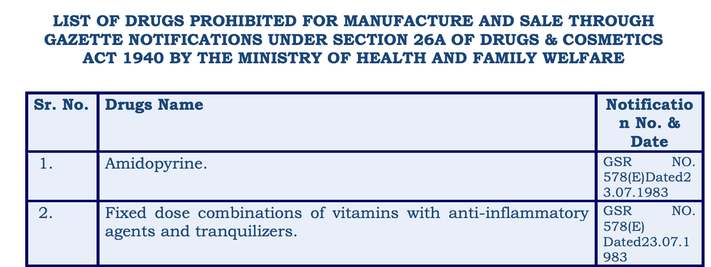
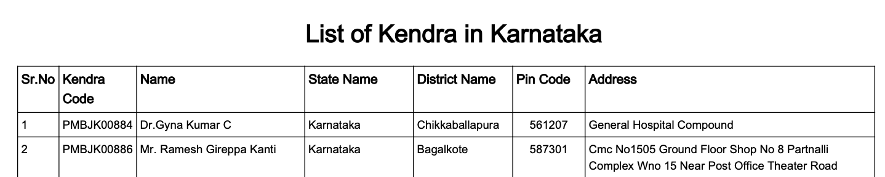
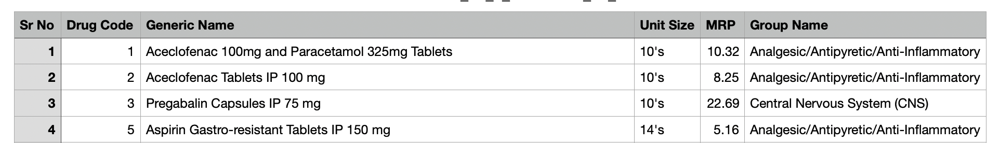

# Indian Pharma Source Lookup

A portfolio demo for searching an existing Supabase pgvector corpus of Jan Aushadhi catalog records, OpenFDA labels, CDSCO list extracts, and Karnataka Kendra directory extracts. It shows source records, not clinical advice, price quotes, or proof that a medicine is currently available.

## Current corpus

The read-only audit on 2026-09-25 found 3,443 `medicines` rows and 2,204 `medicine_chunks` rows, all with embeddings. Four medicine rows are development fixtures and are excluded from public results. No re-ingestion is required for this release. Catalog import dates are not verified publication dates. Existing PDF source URLs point to local files and are hidden in public responses. Some extracted PDF text needs manual source review.

## Run locally

Python 3.11+ and `uv` are recommended:

```bash
uv sync
cp .env.example .env
# Set SUPABASE_URL and SUPABASE_SERVICE_ROLE_KEY in .env
uv run pytest
uv run ruff check .
uv run uvicorn app.main:app --reload
```

Open `/` for the UI, `/docs` for the API, `/health` for the process check, and `/ready` for the embedding model plus database check. Keep the service-role key server-side. With Groq and Cohere keys unset, public queries use no paid provider. Optional query expansion and Cohere reranking can be enabled with API keys; do not add them to a public deployment without a usage budget.

## Retrieval and answer behavior

The service embeds the query with `BAAI/bge-small-en-v1.5`, retrieves up to 25 vector matches and 25 PostgreSQL lexical matches, merges them with reciprocal rank fusion, and optionally applies Cohere reranking. Expanded lexical results are now sorted by their best score across rewrites. Queries with no lexical match abstain; this deliberately sacrifices some semantic-only recall. The public answer copies selected source extracts with source IDs. There is no model-generated clinical synthesis or confidence percentage. Direct requests for dosage, substitution, or personal treatment advice are refused.

Source IDs are record identifiers, not verified publication citations. The imported documents may be stale or contain extraction errors. Confirm clinical and regulatory facts against current primary sources.

## Evaluation

`evaluation/cases.jsonl` fixes 60 source-derived questions: 15 catalog, 10 OpenFDA, 10 CDSCO, 10 Kendra, 10 unsafe clinical, and 5 unrelated. Positive questions have expected record IDs from the audited corpus. The script records recall@5, MRR@5, abstention, citation ID coverage, strict extractive support, warm latency, and provider calls. This is a lookup benchmark, not a medical accuracy study. Run the exact same cases against the previous commit and this version, then compare the results with the corpus checksum recorded in `evaluation/REPORT.md`.

```bash
python evaluation/run.py --mode improved --output evaluation/results/improved.json
```

The results directory is ignored by git because it includes full answers. The report contains aggregate evidence and limitations.

## Render deployment

The Dockerfile installs the app and caches the embedding model in the image. `render.yaml` defines one free web service. In Render, connect this GitHub repository as a Blueprint and set `SUPABASE_URL` and `SUPABASE_SERVICE_ROLE_KEY` as secret environment variables. Keep Groq and Cohere keys unset for the public demo. Verify `/health`, `/ready`, `/`, and a safe `POST /api/v1/query` request after deployment. The free service can sleep after inactivity, so its first request may be slow. The app has a small single-process rate limit; use a managed shared limit before increasing traffic or replicas.

Do not run `supabase_schema.sql` against the live corpus as part of this deployment. It is a setup reference for a new database, not a versioned production migration.

## Source material screenshots







The images in `screenshots/output1.png`, `screenshots/output2.png`, and `screenshots/output3.png` show an earlier UI version; use the running app for the current behavior.
